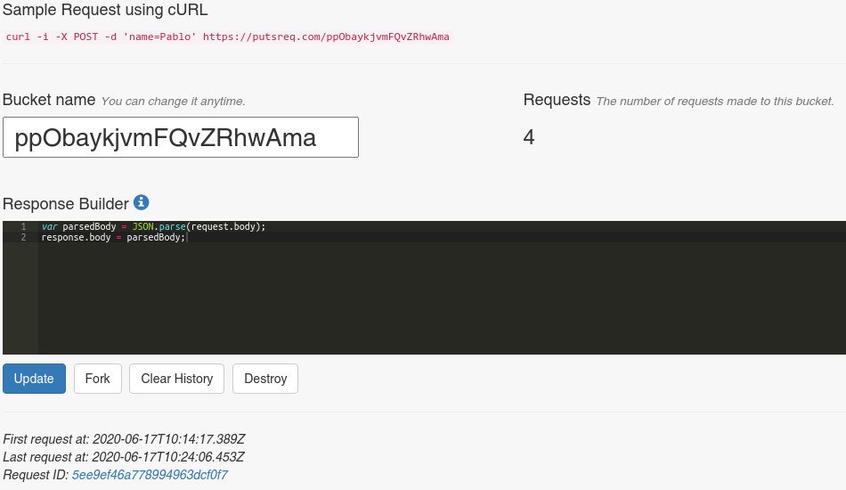
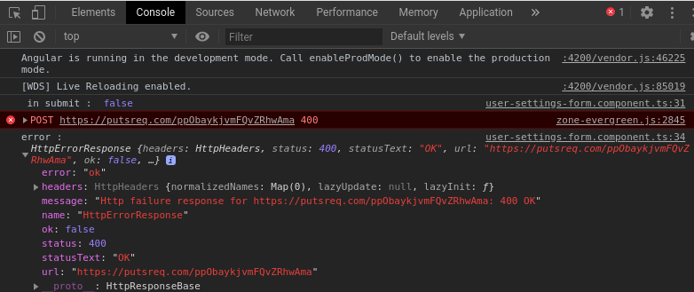

# Angular_Forms

<!-- TOC -->

- [Angular_Forms](#angular_forms)
    - [Form basics](#form-basics)
    - [Creation du projet](#creation-du-projet)
    - [Basic Angular FormsModule](#basic-angular-formsmodule)
        - [Creation d'un component Form (Formulaire)](#creation-dun-component-form-formulaire)
        - [Utilisation de bootstrap pour le style](#utilisation-de-bootstrap-pour-le-style)
        - [Utilisation de checkboxes et radios](#utilisation-de-checkboxes-et-radios)
        - [Controle de la selection et des options](#controle-de-la-selection-et-des-options)
        - [Autre controles du formulaire](#autre-controles-du-formulaire)
    - [Data binding](#data-binding)
        - [Utilisation de NgForm](#utilisation-de-ngform)
        - [NgModel](#ngmodel)
        - [Creation d'un model de data](#creation-dun-model-de-data)
        - [Data binding bidirectionnel](#data-binding-bidirectionnel)
        - [Copie des datas du formulaire](#copie-des-datas-du-formulaire)
    - [Validation du formulaire](#validation-du-formulaire)
        - [Validation de champs HTML](#validation-de-champs-html)
        - [Validation des classes CSS](#validation-des-classes-css)
        - [Validation des proprietes ngModel](#validation-des-proprietes-ngmodel)
        - [Style du formulaire avec les erreurs de validation (toast, pop-up ...)](#style-du-formulaire-avec-les-erreurs-de-validation-toast-pop-up-)
        - [Envoi du formulaire](#envoi-du-formulaire)
        - [Gestion des événements de contrôle du formulaire](#gestion-des-événements-de-contrôle-du-formulaire)
    - [HTTP Posting et acces aux datas](#http-posting-et-acces-aux-datas)
        - [Creation d'un service data a l'aide du CLI angular](#creation-dun-service-data-a-laide-du-cli-angular)
        - [Utilisation des observables pour post le formulaire](#utilisation-des-observables-pour-post-le-formulaire)
        - [Utilisation HttpClient pour l'acces Http](#utilisation-httpclient-pour-lacces-http)
        - [Utilisation de HttpClient pour post le formulaire](#utilisation-de-httpclient-pour-post-le-formulaire)
        - [Gestion des errors post](#gestion-des-errors-post)
        - [Recuperer les datas pour un element selectionne](#recuperer-les-datas-pour-un-element-selectionne)
    - [Third-party Controls](#third-party-controls)
        - [Ressources de formulaire sur angular.io](#ressources-de-formulaire-sur-angulario)
        - [Installation et utilisation de ngx-bootstrap](#installation-et-utilisation-de-ngx-bootstrap)
        - [Les boutons](#les-boutons)
        - [Les dates et periodes](#les-dates-et-periodes)
    - [Bug-fix et Tips](#bug-fix-et-tips)

<!-- /TOC -->

## Form basics

Il existe deux type de formulaire Angulaire:

* Formulaire piloté par modèle
* Formulaire réactif

Voici quelques-unes des différences entre les deux types:

> Les formulaires pilotés par modèles utilisent le "FormsModule", tandis que les formulaires réactifs sont basés sur "ReactiveFormsModule".

> Les formulaires pilotés par modèle sont de nature asynchrone, tandis que les formulaires réactifs sont principalement synchrones.

> Dans une approche basée sur un modèle, la majeure partie de la logique est générée à partir du modèle, tandis que dans une approche réactive, la logique réside principalement dans le code composant ou code typescript.

> Les tests unitaires sont plus facile sur formulaire reactif.

## Creation du projet

1 . Verifier l'installation de nodejs, npm et angular avec les commandes ci-dessous:

```cmd
node -v
npm -v
ng --version
```

2 . Si l'un des packages est manquant se referer a la documentation

https://www.ostechnix.com/install-node-js-linux/

https://cli.angular.io/

3 . Creation du projet angular

```cmd
mkdir [projet]
```


```cmd
cd  [projet]
```

```cmd
// option skip install premet d'installer npm apres.
ng new forms-demo --skip-install
cd forms-demo
// etre super admin
npm install
ng serve
```

**Controler dans votre navigateur que tous fonctionne**

## Basic Angular FormsModule

Dans app.module.ts, on import le module Forms d'angular:

```ts
...
import { FormsModule } from '@angular/forms';

@NgModule({
 ...
  imports: [
    BrowserModule,
    FormsModule
  ],
 ...
```

### Creation d'un component Form (Formulaire)

Executer la commande suivante pour creer le component user-settings-form 

```cmd
ng g c user-settings-form
```

* ng: angular
* g: generate
* c: component
* [Nom du component]

**Lors de la creation la maj automatique de app.module.ts est faite**

1 . Dans le fichier app.component.html, supprimer son contenu et y ajouter la directive du selector du component user-settings-form:

```html
<app-user-settings-form></app-user-settings-form>
```

2 . Dans le fichier user-settings-form.html creer votre formulaire html

```html
<form>
    <input placeholder="name" />
    <button>OK</button>
</form>
```

*Rappel* il est necessaire de rebuild lors de l'ajout de modules.


### Utilisation de bootstrap pour le style

Nous utiliserons https://getbootstrap.com/docs/4.5/components/forms/  pour s'inspirer du templet html de notre formulaire.

1 . Pour cela tapper dans un terminal en su:

```cmd
npm install --save bootstrap
```

2 . Ajouter la propriete style bootstrap dans le fichier angular.json

```json
 "styles": [
              "node_modules/bootstrap/dist/css/bootstrap.min.css",
              "src/styles.css"
            ],
```

**Rebuild Ctrl+C puis ng serve**

3 . Tester bootstrap en changeant le style du bouton

```html
<form>
    <input placeholder="name" />
    <button class="btn btn-primary">OK</button>
</form>
```

4 . Completer votre fichier user-settings-form.html tapper

```html
<form>
    <input placeholder="name" />
    <button>OK</button>
</form>
```

### Utilisation de checkboxes et radios

1 . Completer votre fichier user-settings-form.html par un groupe de bouton radio tapper:

```html
<h5>Style de l'interface utilisateur</h5>
<div class="form-group">
    <div class="form-check">
        <input class="form-check-input" type="radio" id="lightInterface" name="interfaceStyle" value="light">
        <label class="form-check-label" for="lightInterface">
            Light
        </label>
    </div>
    <div class="form-check">
        <input class="form-check-input" type="radio" id="mediumInterface" name="interfaceStyle" value="medium">
        <label class="form-check-label" for="mediumInterface">
            Medium
        </label>
    </div>
    <div class="form-check">
        <input class="form-check-input" type="radio" id="darInterface" name="interfaceStyle" value="dark">
        <label class="form-check-label" for="darInterface">
            Dark
        </label>
    </div>
</div>
```

### Controle de la selection et des options

1 . Completer votre fichier user-settings-form.html par une liste de choix tapper:


```html
<div class="form-group">
    <label for="subscriptionType">Type de souscription</label>
    <select class="form-control" id="subscriptionType" name="subscribeType" >
        <option>Mensuelle</option>
        <option>Annuelle</option>
        <option>Hebdomadaire</option>
    </select>
</div>
```

### Autre controles du formulaire

1 . Completer votre fichier user-settings-form.html par une zone de saisi libre, une zone de saisi password et une saisi de date:

**Changer le contenu de la balise id="testing" et changer input type="color" pour voir leur effet, nous commenterons cette partie pour le reste du cours**

```html
<div class="form-group">
  <label for="notes">Notes</label>
  <textarea class="form-control" name="note" id="notes" rows="3">
  </textarea>
</div>
<div class="form-group">
  <label for="password">Mot de passe</label>
  <input class="form-control" name="password" id="password" type="password">
</div>
<div class="form-group">
  <label for="testing">Test calendrier</label>
  <input class="form-control" name="testing" id="testing" type="date">
</div>
```

##  Data binding

### Utilisation de NgForm

1 . Utiliser une variable de reference sur la directive ngForm

```html
<form #myForm="ngForm">
```

2 . Afficher le résultat à l'aide de l'interpolation ({{}}) en bas du formulaire

```html
{{ myForm }
```

Nous pouvons constater que la variable referent ngForm est de type Object.

3 . Ajouter un filtre json (| json) à notre resultat pour observer le contenu de l'objet.

```html
{{ myForm.form | json }
```

### NgModel

1 . Ajouter ngModel à notre balise input et controler de contenu de la propriete value de notre reference myForm.

```html
<input id="name" name="name" class="form-control" ngModel/>
<h3>{{ myForm.value | json }}</h3>
```

2 . Ajouter ngModel sur tous vos input pour controler leur fonctionnement et reactivite.


**Lors de la saisi d'un nom vous pouvez constater que la valeur name change instantanement**


### Creation d'un model de data

1 . Creer un dossier src/app/data
2 . Creer un fichier user-settings.ts
3 . Creation de l'interface src/app/UserSettings dans user-settings.ts

```ts
export interface defaultUseSettings {
    name: string,
    checkboxNewLetter: boolean,
    interfaceStyle: string,
    subscribeType: string,
    note:string
}
```

4 . Importer l'interface dans src/app/user-settings-form/user-settings-form.component.ts

```ts
...
import { defaultUseSettings } from '../data/user-settings';
...
export class defaultUseSettingsFormComponent implements OnInit {
  defaultUseSettings : defaultUseSettings = {
    name: 'Jean-Yves',
    checkboxNewLetter: true,
    interfaceStyle: 'dark',
    subscribeType: 'Annuelle',
    note:'Veuillez indiquer vos notes/remarques ...'
  };
...
}
```

### Data binding bidirectionnel

1 . Nous allons maintenant brancher notre model a notre formulaire. Pour cela nous ajoutons à notre templet html des banana bracket ( [()] ) autour de [(ngModel)]="defaultUseSettings.[propriete]" et ajouter un controle à la fin.


```html
...
<input id="name" name="name" class="form-control" [(ngModel)]="defaultUseSettings.name"/>
...
<input type="checkbox" class="form-check-input" id="checkbox" name="checkboxNewLetter" [(ngModel)]="defaultUseSettings.checkboxNewLetter">
...
<input class="form-check-input" type="radio" id="lightInterface" name="interfaceStyle" value="light" [(ngModel)]="defaultUseSettings.interfaceStyle">
...
<input class="form-check-input" type="radio" id="mediumInterface" name="interfaceStyle" value="medium" [(ngModel)]="defaultUseSettings.interfaceStyle">
...
<input class="form-check-input" type="radio" id="darInterface" name="interfaceStyle" value="dark" [(ngModel)]="defaultUseSettings.interfaceStyle">
...
<select class="form-control" id="subscriptionType" name="subscribeType" [(ngModel)]="defaultUseSettings.subscribeType">
...
<textarea class="form-control" name="note" id="notes" rows="3" [(ngModel)]="defaultUseSettings.note">
...
<h3>{{ defaultUseSettings | json }}</h3>
```

### Copie des datas du formulaire

Exemple dans le cas d'une deconnexion utilisateur ou un retour arriere de navigation, les données du formulaire initiales ne doivent pas etre corrompu.

1 . Ajouter une copie à l'aide de l'operation spread ...

```ts
userSettings : DefaultUserSettings = { ...this.defaultUserSettings}
```

2 . Nous pouvons controler son effet à l'aide de l'interpolation

```html
<h3>{{ defaultUserSettings | json }}</h3>
<h3>{{ userSettings | json }}</h3>
```

## Validation du formulaire

### Validation de champs HTML

Les attributs de validation HTML5 sont:
* required
* pattern
* minlength
* maxlength
* min
* max ...

1 . Dans notre fichier ts, initialiser votre interface defaultUserSettings à null

```ts
  defaultUserSettings : DefaultUserSettings = {
    name: null,
    checkboxNewLetter: null,
    interfaceStyle: null,
    subscribeType: null,
    note:null
  };
```

2 . Dans le fichier html ajouter dans la balise form ngNativeValidate, cela pour faire reference à une validation des champs par le navigateur. Puis ajouter comme controle sur l'input id="name" required, cela aura pour effet l'affichage d'une pop-up sur le champs Nom si celui-ci n'est pas validé lors du click sur Envoyer

```html
<form #myForm="ngForm" ngNativeValidate>
...
<input required id="name" name="name" class="form-control" [(ngModel)]="defaultUserSettings.name"/>
          
```

3 . Controler son effet.

4 .Remplacer maintenant required par pattern="B.*", cela aura pour effet de forcer l'utilisateur à utiliser notre pattern à savoir, le nom commence par un B suivi de quelque chose.

5 . Remplacer maintenant pattern="B.*" par minlength="3", cela aura pour effet de forcer l'utilisateur à indiquer au minimum 3 caracteres dans son nom.

6 . Remplacer maintenant minlength="3" par maxlength="3", cela aura pour effet de forcer l'utilisateur à utiliser au maximum 3 caracteres dans son nom.

7 . Pour le controle min et max nous devons typer notre input, puis ajouter par exemple min = "3" max = "300". Cela aura pour effet de limiter la saisi utilisateur à saisir un nombre entre 3 et 300.

```html
<input  type="number" min="3" max="300" id="name" name="name" class="form-control" [(ngModel)]="defaultUserSettings.name"/>
```    
### Validation des classes CSS

1 . Remplacer type="number" min="3" max="300" par required.
2 . Ajouter une variable de reference #classTest.
3 . Indiquer dans un h3 les proprietes className de la variable.

```html
<div>
  <label for="name">Nom</label>
    <input required #classTest id="name" name="name" class="form-control" [(ngModel)]="defaultUserSettings.name"/>
</div>
<h3>{{ classTest.className }}</h3>
```

4 . Nous pouvons constater le changement de proprietes lors de la manipulation du champs.

### Validation des proprietes ngModel

1 . Reprenons l'input suivant et ajoutons ngModel comme valeur de notre reference maintenant appelé #propertyTest:

```html
<div>
  <label for="name">Nom</label>
  <input required #propertyTest="ngModel" id="name" name="name" class="form-control"
                  [(ngModel)]="defaultUserSettings.name" />
</div>
<h3>dirty : {{ propertyTest.dirty }}</h3>
<h3>pristine : {{ propertyTest.pristine }}</h3>
<h3>touched : {{ propertyTest.touched }}</h3>
<h3>untouched : {{ propertyTest.untouched }}</h3>
<h3>valid : {{ propertyTest.valid }}</h3>
<h3>invalid : {{ propertyTest.invalid }}</h3>
```

### Style du formulaire avec les erreurs de validation (toast, pop-up ...)

1 . Effacez/ commentez les lignes precedentes utilise pour le debug et modifier votre templet html afin que:

```html
<div>
  <label for="name">Nom</label>
  <input required #nameField="ngModel" id="name" name="name" class="form-control"
                  [(ngModel)]="defaultUserSettings.name" />
</div>
```

2 . Dans le fichier CSS de votre component (ici user-...css mais aurait pu etre sur le component global app...css) taper:

```css
.ng-invalid:not(form).ng-touched {
  border: 1px solid red;
}
```
  **Cela aura pour effet d'encadrer le champ en rouge si le champs est invalid apres que l'utilisateur est fait une tentative**

* not(form) permet d'exclure le selecteur form des bordures de ng-invalid.
* ng-touch permet que le champs soit controler apres le premier click utilisateur dans ce champs. 

3 . Nous ajoutons à notre templet html div class="form-group" de notre input id="name", une div affichant une alerte en dessous du champs.

```html
<div><label for="name">Nom</label>
    <input required #nameField="ngModel" id="name" name="name" class="form-control"
        [(ngModel)]="defaultUserSettings.name" />
    <div [hidden]="nameField.valid ||nameField.untouched" class="alert alert-danger">
        Entrez votre nom
    </div>
</div>
```

*Attention le comportement peut varier suivant le navigateur*

### Envoi du formulaire

1 . Retirer le ngNativeValidate permettant la validation native Html. En effet, nous preferons que la validation soit faite apres le click sur le bouton d'envoie. Et remplacer le par l'appel à la methode onSubmit:

```html
<form #myForm="ngForm" (ngSubmit)="onSubmit(myForm)">
```

2 . Creation de la methode onSubmit dans le fichier user-settings-form.component.ts:


```ts
...
import { NgForm } from '@angular/forms';
...
onSubmit(form : NgForm) {
  console.log(' in submit : ', form.valid);
}
```

3 . Tester dans votre navigateur l'envoi du formulaire en cliquant sur le bouton. Si le formaulaire est incomplet la console nous retourne le message in submit : false sinon true.

4 . Retirer/commenter votre css et remplacer le par un selecteur de classe "classique":

```css
.field-error{
    border: 1px solid red;
}
```

5 . Dans le html, bind [class.field-error] sur l'input id="name" et l'activer si myForm.submitted && nameField.invalid return true.

```html
<input required #nameField="ngModel" id="name" name="name" class="form-control"
                    [(ngModel)]="defaultUserSettings.name" 
                    [class.field-error]="myForm.submitted && nameField.invalid"/>
```

6 . Sur la div de pop-up changer la condition d'affichage telquelle, cad, pop-up reste caché tant que l'on a pas clické sur le bouton ou que nameField soit valid:

```html
 <div [hidden]="!myForm.submitted || nameField.valid" class="alert alert-danger">
```

### Gestion des événements de contrôle du formulaire

1 . Exemple avec evenement onblur sur l'input id="name", l'evenement se produit lorsque l'utilisateur change de champs dans le formulaire (ici champs nom). Ajouter la methode ci-dessous a votre fichier html et coder la methode onBlur dans votre ts:

```html
<input required #nameField="ngModel" id="name" name="name" class="form-control"
    [(ngModel)]="defaultUserSettings.name"
    (blur)="onBlur(nameField)" 
    [class.field-error]="myForm.submitted && nameField.invalid"/>
```
```ts
  onBlur(field : NgModel) {
    console.log(' in onBlur :', field.valid)
  }
```
2 . Tester son effet dans votre navigateur, console ouverte.

## HTTP Posting et acces aux datas

### Creation d'un service data a l'aide du CLI angular

1 . Ouvrir un termine sur le path: src/app/data et taper la commande ci-dessous pour generer (g) un service (s) au nom de data.

```cmd
ng g s data
```

2 . Coder la methode du service qui sera appele lors de l'envoi du formulaire (postUserSettingsForm):

```ts
...
import { DefaultUserSettings } from './default-user-settings';
...
export class DataService {
  ...
  postUserSettingsForm(userSettings: DefaultUserSettings) {
  }
}
```

### Utilisation des observables pour post le formulaire

Le traitement de l'envoi du formulaire par le server est asynchrone, et cela peut prendre un certain temps si nous avons un server ou connexion lente. Angular utilise des observables pour la programmation asynchrone.

Le modèle d'observateur est un modèle de conception logicielle dans lequel un objet, appelé le **subject**, conserve une liste de ses dépendances, appeles **observers**, et les informe automatiquement des changements d'état. Ce modèle est similaire (mais pas identique) au modèle de conception de **publish** / **subscribe**.

Les observables sont déclaratifs, c'est-à-dire que vous définissez une fonction pour publier des valeurs, mais elle n'est pas exécutée tant qu'un consommateur n'y a pas souscrit. Le consommateur abonné, reçoit ensuite des notifications jusqu'à la fin de la fonction ou jusqu'à ce qu'il se désabonne.

Un observable peut fournir plusieurs valeurs de n'importe quel type: littéraux, messages ou événements, selon le contexte. L'API de réception des valeurs est la même, que les valeurs soient fournies de manière synchrone ou asynchrone. Parce que la logique de configuration et de démontage sont toutes deux gérées par l'observable, votre code d'application n'a qu'à se soucier de s'abonner pour consommer des valeurs et, une fois terminé, de se désinscrire. Que le flux soit composé de touches, d'une réponse HTTP ou d'un temporisateur d'intervalle, l'interface pour écouter les valeurs et arrêter l'écoute est la même.

En raison de ces avantages, les observables sont largement utilisés dans Angular et sont également recommandés pour le développement d'applications.

1 . Completer la methode postUserSettingsForm():

```ts
...
import { Observable, of } from 'rxjs';
...
  postUserSettingsForm(userSettings: DefaultUserSettings) : Observable<DefaultUserSettings>{
    return of(userSettings);
  }
```

2 . Completer votre fichier user-settings-form.component.ts en passant en parametre du constructeur un attribut prive membre de la classe DataService:

```ts
...
import { DataService } from '../data/data.service';
...
constructor(private dataService : DataService) {}
```

3 . Completer la methode onSubmit

```ts
...
onSubmit(form : NgForm) {
  console.log(' in submit : ', form.valid);
  this.dataService.postUserSettingsForm(this.defaultUserSettings).subscribe(
    result => console.log('sucess : ', result),
    error => console.log ('error : ', error)
  );
}
...
```

4 . Tester dans votre navigateur console ouverte que vont recuperiez bien les console log de l'observable.

### Utilisation HttpClient pour l'acces Http

1 . Importer HttpClient dans le fichier app.module.ts

```ts
...
import { HttpClientModule } from '@angular/common/http';
...
@NgModule({
...
  imports: [
    ...
    HttpClientModule
  ],
  ...
})
```

2 . Completer votre fichier data.service.ts en passant en parametre du constructeur un attribut prive membre de la classe HttpClient:

```ts
...
import { HttpClient } from '@angular/common/http';
...
export class DataService {
  constructor(private http : HttpClient) { }
  ...
}
```

3 . Remplacer le 'fake' observables retourne par la methode postUserSettingsForm par:

```ts
...
export class DataService {
  constructor(private http : HttpClient) { }
  postUserSettingsForm(userSettings: DefaultUserSettings) : Observable<any>{
    return this.http.post('url', userSettings);
    // return of(userSettings);
  }
}
```

### Utilisation de HttpClient pour post le formulaire

Postons notre formulaire sur un endpoint reel. Pour cela nous utiliserons l'outil PutsReq https://putsreq.com/?utm_source=recordnotfound.com.

1 . Dans PutsReq, cliquer sur le bouton "create a PutsReq" et copier/ coller l'url apres 'name=Pablo' pour le coller sur le parametre url de la methode postUserSettingsForm.

```ts
  postUserSettingsForm(userSettings: DefaultUserSettings) : Observable<any>{
    return this.http.post('https://putsreq.com/FnEgsJhPiCeGZGwSHOc7', userSettings);
    // return of(userSettings);
  }
```

2 . Renseigner dans PutsReq la reponse attendu en éditant la partie "Response Builder" et y indiquer:

```js
var parsedBody = JSON.parse(request.body);
response.body = parsedBody;
```

**Cliquer sur le bouton update poour la prise en compte de vos modification dans PutsReq**

3 . Tester dans votre navigateur... Si une erreur du type CORS Error — and How the Access-Control-Allow-Origin Header Works apparait. Cliquer dans l'inspecteur de votre navigateur dans network puis editer et renvoyer la requete en specifiant dans le header access-control-allow-origin: *. Puis controler votre interface putsreq



4 . Amusez-vous ensuite à completer la reponse builder retournee par putsreq, par exemple, en retournant l'id 'fictif' de la base de donnée, pour observer le resultat dans votre navigateur lors de l'envoi de votre formulaire.

```js
var parsedBody = JSON.parse(request.body);
parsedBody.id='5124'
response.body = parsedBody;
```

### Gestion des errors post

1 . Commentez/ Supprimez la reponse builder de putsreq pour y indiquer desormais une reponse nous retournant une erreur type 400:

```js
/* var parsedBody = JSON.parse(request.body);
parsedBody.id='5124'
response.body = parsedBody; */
response.status = 400;
```

2 . Tester dans votre navigateur, console ouverte.



Nous pouvons a partir de cela, declencher une reponse en erreur, sur notre front, un utilisant la propriete de l'objet HttpErrorResponse.status=400. 

3 . Coder la reponse en erreur et la methode onHttpError(error) en utilisant deux attributs boolean initialise a faux et un string initialise.

```ts
  postError =  false;
  postErrorMessage = '';
  ...
  onSubmit(form : NgForm) {
    console.log(' in submit : ', form.valid);
    this.dataService.postUserSettingsForm(this.defaultUserSettings).subscribe(
      result => console.log('sucess : ', result),
      error => this.onHttpError(error)
    );
  }
  onHttpError(errorResponse: any): void {
    console.log('error: ', errorResponse);
    this.postError = true;
    this.postErrorMessage = errorResponse.error.errorMessage;
  }
```

4 . Ajouter à notre templet le controle de l'attributs postErrorMessage (interpolation)
 
```html
<div [hidden]="!postError" class="alert alert-danger">
  {{ postErrorMessage }}
</div>
```

5 . Ajouter dans la requete builder de putsreq, puis update :

```js
/* var parsedBody = JSON.parse(request.body);
parsedBody.id='5124'
response.body = parsedBody; */
response.status = 400;
response.body = { errorMessage: 'Les erreurs seront ici ....' };
```

6 . Ajouter a la methode onSubmit une condition de validation

```js
onSubmit(form : NgForm) {
  if(form.valid){
    this.dataService.postUserSettingsForm(this.defaultUserSettings).subscribe(
      result => console.log('sucess : ', result),
      error => this.onHttpError(error)
    );
  }
  else {
    this.postError = true;
    this.postErrorMessage = "Veuillez fixer les erreurs ci-dessus"
  }
}
```

### Recuperer les datas pour un element selectionne

1 . A l'aide de la directive *ngFor creer une liste en lieu et place de la selection du type de souscription 'Annuelle'...

```html
<select class="form-control" id="subscriptionType" name="subscribeType"
    [(ngModel)]="defaultUserSettings.subscribeType">
    <option  *ngFor="let type of subscriptionTypes">
        {{ type }}
    </option>
</select>
```

2 . Declarer l'attribut subscriptionTypes dans votre component.

```ts
subscriptionTypes = ['Annuelle', 'Hebdomadaire', 'Mensuelle'];
```

3 . Modifier l'attribut subscriptionTypes dans votre component.

```ts
...
import { Observable } from 'rxjs';
...
subscriptionTypes: Observable<string[]>;
...
```

4 . Nous allons maintenant initialiser le component à l'aide de ngOnInit() et initialiser l'attibut subscriptionTypes en utilisant le dataService puis nous declarons la methode retournant les datas:


Dans user-settings-form.component.ts
```ts
  ngOnInit(): void {
    this.subscriptionTypes = this.dataService.getSubscriptiontypes();
  }
```

Dans dat.service.ts
```ts
getSubscriptiontypes(): Observable<string[]> {
  return of(['Mensuelle', 'Annuelle', 'Hebdomadaire']);
}
```

5 . Maintenant que notre list est un observable, nous devons ajouter un pipe asynchrone a notre templet html (|async)

```html
<option  *ngFor="let type of subscriptionTypes | async">
    {{ type }}
</option>

```


## Third-party Controls

Le probleme a resoudre et le cross-platform. Chaque navigateur reagissent differemment. Pour resoudre le proble nous etidirons les ressources angular.io et ngx-bootstrap

### Ressources de formulaire sur angular.io

* https://angular.io/resources?category=development
* https://material.angular.io/ ( component>form control )
* https://www.primefaces.org/primeng/

### Installation et utilisation de ngx-bootstrap

1 . Ajouter le component buttons de la librairy ngx-bootstrap

```cmd
ng add ngx-bootstrap --component buttons
```

2 . Importer la librairie dans le module:

```ts
import { ButtonsModule } from 'ngx-bootstrap/buttons';

@NgModule({
  ...
  imports: [  
    ...
    ButtonsModule.forRoot()
  ],
```
3 . Testons le bouton ngx Custom checkbox value dans notre template html et ajouter singleModel comme attribut dans notre component

Templet
```html
<button name ="singleModel" type="button" class="btn btn-primary" [(ngModel)]="singleModel" btnCheckbox btnCheckboxTrue="On"
    btnCheckboxFalse="Off">
    {{ singleModel }
</button>
```
Component
```ts
  singleModel = "On";
```

### Les boutons

1 . Recuperer les boutons radio de la doc ngx  et les remplacer en lieu et place de notre choix d'interface:


```html
<div class="form-group">
    <div class="btn-group">
        <label name="interfaceStyle" class="btn btn-primary" [(ngModel)]="defaultUserSettings.interfaceStyle"
            btnRadio="Light" tabindex="0" role="button">Light</label>
        <label name="interfaceStyle" class="btn btn-primary" [(ngModel)]="defaultUserSettings.interfaceStyle"
            btnRadio="Medium" tabindex="0" role="button">Medium</label>
        <label name="interfaceStyle" class="btn btn-primary" [(ngModel)]="defaultUserSettings.interfaceStyle"
            btnRadio="Dark" tabindex="0" role="button">Dark</label>
    </div>
</div>
```

2 . Controler l'etat des boutons, commenter le contenu de la methode onSubmit et un indiquer un console.log(' in submit : ', form.value);

### Les dates et periodes

1 . installer et ajouter le component datapicker à votre projet et module

```cmd
ng add ngx-bootstrap  --component datepicker
```
```ts
import { BrowserAnimationsModule } from '@angular/platform-browser/animations';
import { BsDatepickerModule } from 'ngx-bootstrap/datepicker';
  imports: [
    ...
    BrowserAnimationsModule,
    BsDatepickerModule.forRoot()
  ],
```

2 . Ajouter le templet du calendrier à notre templet

```html
<div class="form-group">
  <label for="startDate">Date</label>
  <input type="text" placeholder="Start Date" class="form-control" [(ngModel)]="startDate"
      name="startDate" id="startDate" bsDatepicker>
</div>
```

3 . Initialiser starDate dans le component

```ts
  startDate: Date;
  ...
  ngOnInit(): void {
  ...
    this.startDate = new Date();
  }
```

4 . Ajouter à votre fichier angular.json

```json
 "styles": [
              "node_modules/ngx-bootstrap/datepicker/bs-datepicker.css",
            ],
```

## Bug-fix et Tips


1 . tsconfig.json ==> file not found
* Ajouter à votre fichier de config

```json
  "include": [
    "src/**/*"
  ],
```

2 . Copie proprietes avec l'operateur spread ...  pour faire une copie d'un objet dans un objet utiliser l'operateur lodash